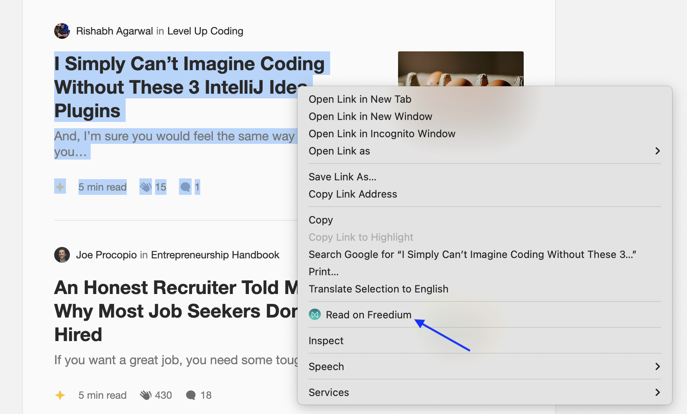

# freedium-extension
Freedium: Your paywall breakthrough for Medium!

This Chrome extension allows users to open [Medium](https://medium.com/) articles on [Freedium](https://www.freedium.cfd/) by adding a context menu item that only appears when right-clicking on a Medium.com link.

- Adds a context menu item labeled "Read on Freedium" when you right-click on a Medium.com link.
- Automatically redirects the Medium.com article to https://www.freedium.cfd/ when selected.


## Use Case:

You recieved a medium article and want read it but is it a paid article. Having this extension is helpful opening the link on [Freedium](https://www.freedium.cfd/) and bypassing the  medium paywall



## Installation

1. **Clone the repository**:
   ```bash
   git clone https://github.com/yourusername/freedium-extension.git
   ```
   
2. **Navigate to the directory**:
   ```bash
   cd freedium-extension
   ```

3. **Load the extension in Chrome**:
   - Open Chrome and go to `chrome://extensions/`.
   - Enable "Developer mode" by toggling the switch in the top right corner.
   - Click "Load unpacked" and select the project directory.

4. **Test the extension**:
   - Navigate to any Medium.com article.
   - Right-click the link and choose "Read on Freedium" from the context menu.
   - The article should open in Freedium.

## Files

- **manifest.json**: Configuration file that defines the extension's properties, permissions, and entry points.
- **background.js**: JavaScript file that contains the logic for creating the context menu and handling clicks.
- **icons/**: Directory containing the icons used for the extension (16x16, 48x48, and 128x128).

## Usage

Once the extension is loaded:

1. Right-click on any link to a Medium.com article.
2. Select "Read on Freedium" from the context menu.
3. The article will open with the Freedium prefix (`https://www.freedium.cfd/`).

## Development

To make modifications:

1. Edit the code in `background.js` and `manifest.json`.
2. Reload the extension in Chrome by visiting `chrome://extensions/` and clicking the "Reload" button for the extension.
3. Test your changes by right-clicking Medium.com links.

## Inspiration
This project was inspired by [Meenal](), whose idea provided valuable guidance in the development of this extension.

## License

This project is licensed under the MIT License. See the [LICENSE](LICENSE) file for details.
